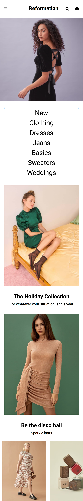
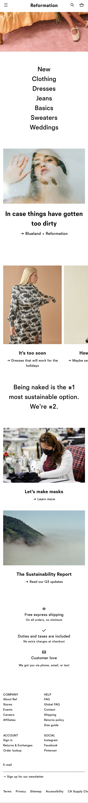
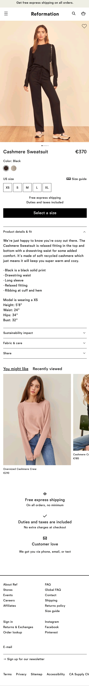

# Procesverslag
**Auteur:** Tamar Langenburg

## Bronnenlijst
1. -bron 1-
2. -bron 2-
3. -...-

## Eindgesprek (week 7/8)

-dit ging goed & dit was lastig-

**Screenshot(s):**

-screenshot(s) van je eindresultaat-

## Voortgang 3 (week 6)

-same as voortgang 1-

## Voortgang 2 (week 5)

-same as voortgang 1-

## Voortgang 1 (week 3)

### Stand van zaken

Ik ben nu nog bezig met mijn startpagina. Omdat ik niet veel ervaring heb duurt het ietsje langer. Wel kom ik er meestal zelf uit als ik iets niet snap.

**Screenshot(s):**

### Agenda voor meeting

| Tamar          | Zara.              | Lotte        | Nora             |
| -------------- | ------------------ | ------------ | ---------------- |
| navigatiebalk  | Filmpje afspelen   | Hamburgermenu| positioneren     |
| hamburgermenu  | hamburgermenu      | imageslider  | Flexbox          |
| flex en grid   | image slider       |              |                  |
| uitklap menu   | ...                | ...          | ...              |

### Verslag van meeting

-na afloop snel uitkomsten vastleggen-

## Breakdownschets (week 1)

## Intake (week 1)

**Je startniveau:** -blauw-

Ik heb nog weinig ervaring. Daarom zou ik mezelf op de blauwe piste plaatsen.

**Je focus:** -surface plane en responsive-

Ik wil mezelf zoveel mogelijk pushen en kijken hoever ik kom met wat ik responsive kan maken.

**Je opdracht:** 

Ik heb voor de website van The Reformation gekozen. Ik vind de vormgeving mooi en dit is voor mij al een goede uitdaging.
https://www.thereformation.com/

**Screenshot(s) van de eerste pagina (small screen):**

**Screenshot(s) van de tweede pagina (small screen):**

