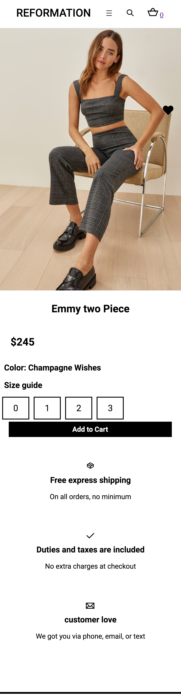
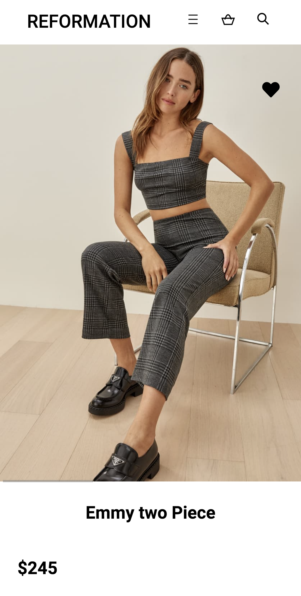

# Procesverslag
**Auteur:** Tamar Langenburg

## Bronnenlijst
1. -bron 1-
2. -bron 2-
3. -...-

## Eindgesprek (week 7/8)

-dit ging goed & dit was lastig-

**Screenshot(s):**

-screenshot(s) van je eindresultaat-

## Voortgang 3 (week 6)

### Stand van zaken

Ik ben verder gegaan met de detailpagina. ik heb vooral dingen uit geprobeert met de microinteracties. Met de vormgeving ben ik nog niet heel blij, hieraan wil ik nog verder werken. 
**Screenshot(s):**

 

### Agenda voor meeting

| Tamar          | Zara.              | Lotte        | Nora             |
| -------------- | ------------------ | ------------ | ---------------- |
| vormgeving     | flexbox            | ...          | positionering    |
| buttons        | image slider       | ...          | ...              |
| microineracties| ...                | ...          | ...              |
| ...            | ...                | ...          | ...              |

### Verslag van meeting

## Voortgang 2 (week 5)

### Stand van zaken

IK ben nu bezig met de detailpagina en heb al veel vooruitgang kunnen maken met de homepage. Ik maak nog kleine stapjes, maar ik merk dat als ik er even goed voor ga zitten dat ik er uiteindelijk wel kom.
**Screenshot(s):**

 

### Agenda voor meeting

| Tamar          | Zara.              | Lotte        | Nora             |
| -------------- | ------------------ | ------------ | ---------------- |
| navigatiebalk  | style 2e pagina    | margin       | styling          |
| animatie       | css                | knoppen      | Classes divs     |
| flex en grid   | ...                | ...          | ...              |
| ...            | ...                | ...          | ...              |

### Verslag van meeting

IK heb nu een beter idee waar ik mee verder moet. Ik kan nu verder met de bijvoorbeeld de imageslider en navigatiebalk. 

## Voortgang 1 (week 3)

### Stand van zaken

Ik ben nu nog bezig met mijn startpagina. Omdat ik niet veel ervaring heb duurt het ietsje langer. Wel kom ik er meestal zelf uit als ik iets niet snap.

**Screenshot(s):**

### Agenda voor meeting

| Tamar          | Zara.              | Lotte        | Nora             |
| -------------- | ------------------ | ------------ | ---------------- |
| navigatiebalk  | Filmpje afspelen   | Hamburgermenu| positioneren     |
| hamburgermenu  | hamburgermenu      | imageslider  | Flexbox          |
| flex en grid   | image slider       |              |                  |
| uitklap menu   | ...                | ...          | ...              |

### Verslag van meeting

IK heb nu een beter idee waar ik mee verder moet. Ik kan nu verder met de bijvoorbeeld de imageslider en navigatiebalk. 

## Breakdownschets (week 1)

## Intake (week 1)

**Je startniveau:** -blauw-

Ik heb nog weinig ervaring. Daarom zou ik mezelf op de blauwe piste plaatsen.

**Je focus:** -surface plane en responsive-

Ik wil mezelf zoveel mogelijk pushen en kijken hoever ik kom met wat ik responsive kan maken.

**Je opdracht:** 

Ik heb voor de website van The Reformation gekozen. Ik vind de vormgeving mooi en dit is voor mij al een goede uitdaging.
https://www.thereformation.com/

**Screenshot(s) van de eerste pagina (small screen):**

**Screenshot(s) van de tweede pagina (small screen):**

